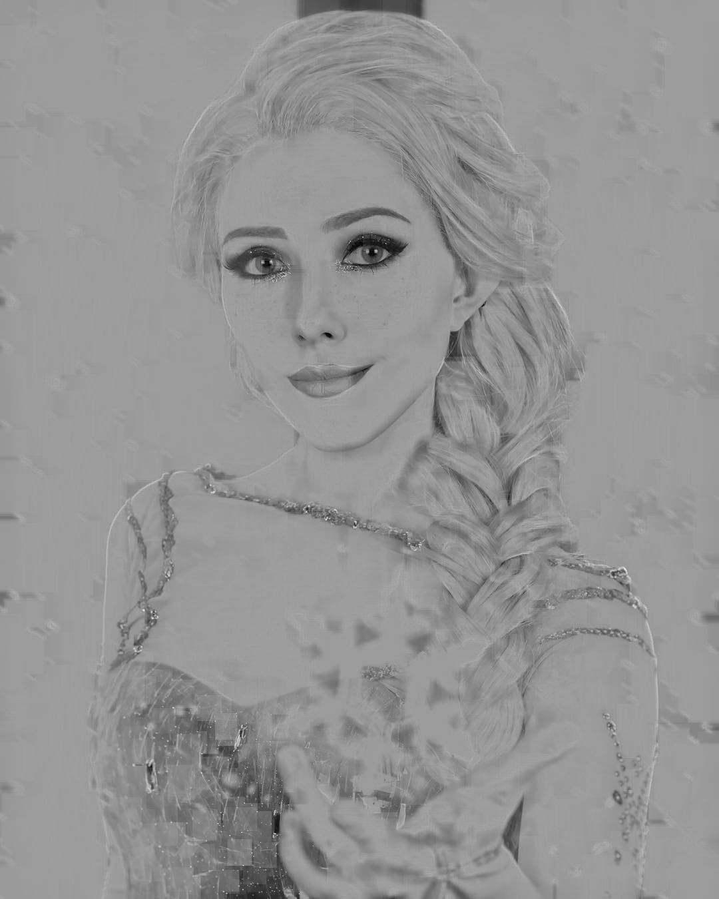

# Utility
some program I wrote and used in my study or work
# enhance gray picture
I read this interesting blog and implemented it
use only numpy and a few opencv function to enhace a gray scale picture and remove shading
[click here](https://medium.com/swlh/enhancing-gray-scale-images-using-numpy-open-cv-9e6234a4d10d) to checkout this blog

maybe someday i'll write a im2col version
