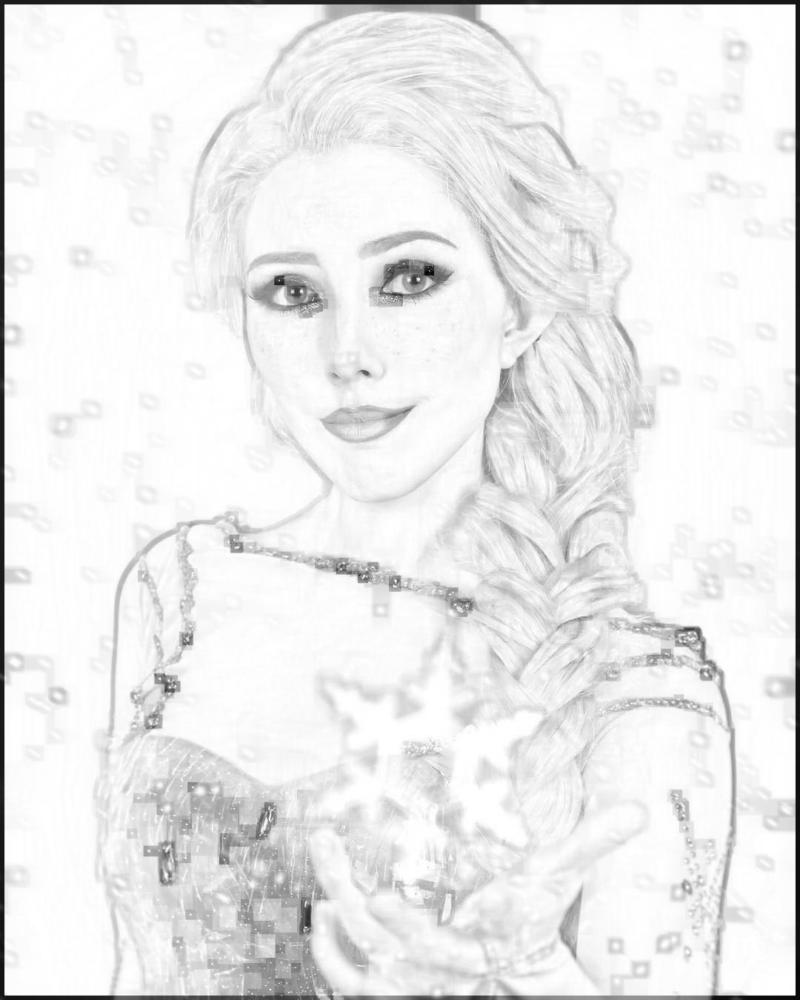

# enhance gray picture
I read this interesting blog and implemented it

Using only numpy and a few opencv function to enhace a gray scale picture and remove shading

## to see more details 

    python enhance_gray_picture.py -h or --help

[click here](https://medium.com/swlh/enhancing-gray-scale-images-using-numpy-open-cv-9e6234a4d10d) to checkout this blog

filter-size=31    filter-size=33

Maybe someday I'll write a im2col version

